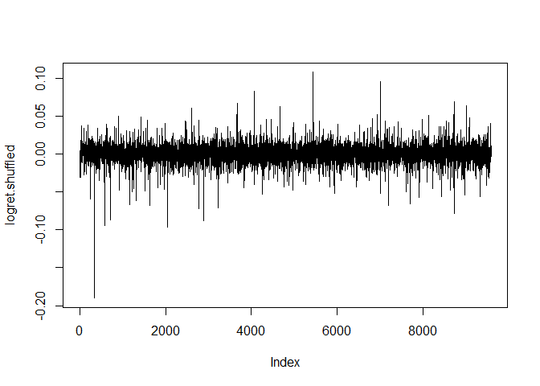
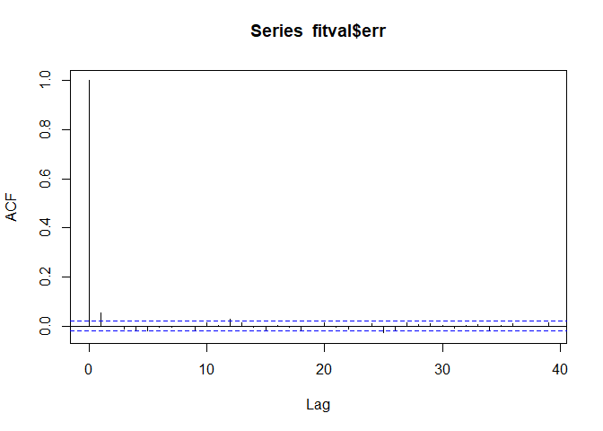

# Financial Risk Management

A hedge fund invested $1 billion in a diversified portfolio of US equities (Wilshire 5000).

We would like to know:
- How much money could they possibly lose? 
- Can they afford to lose this amount of money?

## Data Collection and Preparation

Load the required packages.

``` r
library(quantmod)
library(moments)
library(MASS)
library(metRology)
library(rugarch)
library(ggplot2)
```

Retrieve the price of Wilshire 5000 Total Market Index using the
quantmod library.

``` r
wilsh <- getSymbols('WILL5000IND', src = 'FRED', auto.assign = FALSE)
```

Remove the missing data.

``` r
wilsh <- na.omit(wilsh)
```

Calculate the daily log returns and include only the data from 1980 to
2017

``` r
logret <- diff(log(wilsh))
logret <- logret["1980-01-01/2017-12-31"]
head(logret)
```

    ##             WILL5000IND
    ## 1980-01-02 -0.021277398
    ## 1980-01-04  0.010695289
    ## 1980-01-07  0.005305052
    ## 1980-01-08  0.020943174
    ## 1980-01-09  0.000000000
    ## 1980-01-10  0.010309370

Plot the daily log returns.

``` r
ggplot(logret) + geom_line(aes(x=index(logret), y=logret)) +
  labs(title = 'Daily Log Returns of the Wilshire 5000 Index', x='', y='Log Returns')
```

<!-- -->

Calculate the daily discrete/arithmetic returns from the daily log
returns.

``` r
ret <- exp(logret) - 1
```

Log returns is preferred as it allows for easier time-aggregation
i.e. it is easy to go from one-day log returns to longer period log
returns. For example, weekly log return is just the sum of all daily log
returns in the week.

Calculate the weekly, monthly, quarterly, and yearly log returns and
discrete returns.

``` r
logret.w <- apply.weekly(logret,sum) # sums the daily log returns from Monday to Friday
logret.m <- apply.monthly(logret,sum)
logret.q <- apply.quarterly(logret,sum)
logret.y <- apply.yearly(logret,sum)
```

The longer period arithmetic returns can be calculated from the
corresponding log returns using the same formula.

Calculate longer period arithmetic returns from the log returns.

``` r
ret.w <- exp(logret.w)-1
ret.m <- exp(logret.m)-1
ret.q <- exp(logret.q)-1
ret.y <- exp(logret.y)-1
```

## 1-day Value-at-Risk at 95% Confidence Level and Expected Shortfall

-   Value-at-Risk (VaR) is the amount that a portfolio might lose over a
    specific period at a given confidence level.

-   Expected Shortfall (ES) is the expected loss given that the loss is
    larger than the VaR.

### Method 1. Estimate the VaR and ES of the normal distribution

Estimate the parameters of the normal distribution (mean and standard
deviation)

``` r
mu <- mean(logret)
sig <- sd(logret)
cbind(mu, sig)
```

    ##                mu        sig
    ## [1,] 0.0004357469 0.01072056

Estimate the VaR and ES of the normal distribution with the estimated
parameters *mu* and *sig*

``` r
alpha <- 0.05
var <- qnorm(alpha,mu,sig) # VaR is a quantile (i.e. for 95% confidence level -> 5% quantile)
es <- mu-sig*dnorm(qnorm(alpha,0,1),0,1)/alpha
cbind(var, es)
```

    ##              var          es
    ## [1,] -0.01719801 -0.02167769

Estimate the VaR and ES of the portfolio

``` r
usdvar <- 1000 * (exp(var)-1) # in million dollars
usdes <- 1000 * (exp(es)-1) # in million dollars
cbind(usdvar, usdes)
```

    ##          usdvar    usdes
    ## [1,] -17.05097 -21.44442

At 95% confidence level, the hedge fund is not likely to lose more than
$17.05 million over a day. If losses fell by more than the VaR, the
hedge fund is expected to lose $21.44 million in a day.

### Method 2. Estimate the VaR and ES by simulating from the normal distribution

Simulate 100,000 1-day log returns from the normal distribution with the
estimated parameters *mu* and *sig*. Calculate the VaR and ES for these
100,000 outcomes.

``` r
alpha <- 0.05
set.seed(123789)
rvec.norm <- rnorm(100000,mu,sig)
var.norm <- quantile(rvec.norm,alpha)
es.norm <- mean(rvec.norm[rvec.norm<var.norm])
cbind(var.norm,es.norm)
```

    ##       var.norm     es.norm
    ## 5% -0.01728895 -0.02189033

Estimate the VaR and ES of the portfolio

``` r
usdvar.norm <- 1000 * (exp(var.norm)-1)
usdes.norm <- 1000 * (exp(es.norm)-1)
cbind(usdvar.norm,usdes.norm)
```

    ##    usdvar.norm usdes.norm
    ## 5%  -17.14036   -21.65248

### Method 3. Estimate the VaR and ES by simulating from the observed distribution of the data

Unlike the previous two methods, this method does not assume that the
log returns follow a normal distribution.

Draw 100,000 1-day log returns from the empirical distribution.
Calculate the VaR and ES for these 100,000 outcomes.

``` r
alpha <- 0.05
set.seed(123789)
rvec.obs <- sample(as.vector(logret),100000,replace=TRUE)
var.obs <- quantile(rvec.obs,alpha)
es.obs <- mean(rvec.obs[rvec.obs<var.obs])
cbind(var.obs,es.obs)
```

    ##        var.obs      es.obs
    ## 5% -0.01619973 -0.02593798

Estimate the VaR and ES of the portfolio

``` r
usdvar.obs <- 1000 * (exp(var.obs)-1)
usdes.obs <- 1000 * (exp(es.obs)-1)
cbind(usdvar.obs,usdes.obs)
```

    ##    usdvar.obs usdes.obs
    ## 5% -16.06922  -25.60448

Compare the results of the three methods

``` r
# VaR
rbind(var, var.norm, var.obs)
```

    ##                   5%
    ## var      -0.01719801
    ## var.norm -0.01728895
    ## var.obs  -0.01619973

``` r
# VaR in Million USD
rbind(usdvar, usdvar.norm, usdvar.obs)
```

    ##                   5%
    ## usdvar      -17.05097
    ## usdvar.norm -17.14036
    ## usdvar.obs  -16.06922

``` r
# ES
rbind(es, es.norm, es.obs)
```

    ##                [,1]
    ## es      -0.02167769
    ## es.norm -0.02189033
    ## es.obs  -0.02593798

``` r
# ES in Million USD
rbind(usdes, usdes.norm, usdes.obs)
```

    ##                [,1]
    ## usdes      -21.44442
    ## usdes.norm -21.65248
    ## usdes.obs  -25.60448

The results of the third method are different from the results of the
other two methods. The difference is due to the normality assumption made in
the first two methods.

---

## Test for Normality

**Check if daily log returns are normally distributed.**

Check the density plot and qq plot.

``` r
ggplot(logret) + geom_density(aes(x=logret)) + labs(title = 'Distribution of Returns')
```

<!-- -->

``` r
qqnorm(logret)
qqline(logret) 
```

<!-- -->

Based on the plots, the daily log returns of Wilshire 5000 does not seem
to follow the normal distribution.

Calculate the skewness and kurtosis to further check.

``` r
rvec <- as.vector(logret)
sk <- skewness(rvec)
kt <- kurtosis(rvec)
cbind(sk, kt)
```

    ##              sk       kt
    ## [1,] -0.9135648 21.80372

The skewness and kurtosis of the normal distribution are 0 and 3,
respectively. Meanwhile, the skewness and kurtosis of the distribution
of log returns are -0.91 and 21.80. This suggests that the data is not
normally distributed.

Perform the Jarque-Bera Test for Normality to confirm.

``` r
# Null Hypothesis: The daily log returns are normally distributed.
jarque.test(rvec)
```

    ##
    ##  Jarque-Bera Normality Test
    ##
    ## data:  rvec
    ## JB = 142514, p-value < 2.2e-16
    ## alternative hypothesis: greater

*Reject the null hypothesis. There is enough evidence to say that the
daily log returns is not normally distributed. In this case, it is
therefore incorrect to calculate the VaR and ES under the assumption of
normality.*

---

### Method 4. Estimate the VaR and ES by simulating from the student-t distribution

The distribution of daily log returns is heavy/fat-tailed as indicated by the
high kurtosis, which means extreme outcomes happened more than expected.
A student-t distribution may be a better fit to the data. In fact, student-t
distribution is one of the most commonly used fat-tailed distributions in the
literature for modeling asset returns.

Estimate the parameters of the student-t distribution (mean, standard
deviation, degrees of freedom)

``` r
t.fit <- fitdistr(rvec, "t")
t.fit$estimate
```

Simulate 100,000 1-day log returns from the scaled student-t distribution with
the estimated parameters. Calculate the VaR and ES for these 100,000
outcomes.

``` r
alpha <- 0.05
set.seed(123789)
rvec.t <- rt.scaled(100000,mean=t.fit$estimate[1],sd=t.fit$estimate[2],df=t.fit$estimate[3])
var.t <- quantile(rvec.t,alpha)
es.t <- mean(rvec.t[rvec.t<var.t])
cbind(var.t,es.t)
```

    ##          var.t        es.t
    ## 5% -0.01470236 -0.02429238

Estimate the VaR and ES of the portfolio

``` r
usdvar.t <- 1000 * (exp(var.t)-1)
usdes.t <- 1000 * (exp(es.t)-1)
cbind(usdvar.t,usdes.t)
```

    ##      usdvar.t usdes.t
    ## 5% -14.59481 -23.9997

## Changing the Time Horizon: 10-day Value-at-Risk at 95% Confidence Level and Expected Shortfall

Aside from one day, we can also compute for VaR and ES over longer time
horizon.

### Method 1: Calculate the VaR and ES by simulating from the student-t distribution with the estimated parameters

Simulate ten 1-day log returns from the scaled student t distribution with the
estimated parameters then add them up. Repeat this 100,000 times then
calculate the VaR and ES for these 100,000 outcomes.

``` r
alpha <- 0.05
set.seed(123789)
rvec.t10 <- rep(0,100000)
for (i in 1:10) {
  rvec.t10 <- rvec.t10+rt.scaled(100000,mean=t.fit$estimate[1],sd=t.fit$estimate[2],df=t.fit$estimate[3])
}
var.t10 <- quantile(rvec.t10,alpha)
es.t10 <- mean(rvec.t10[rvec.t10<var.t10])
cbind(var.t10,es.t10)
```

    ##        var.t10      es.t10
    ## 5% -0.04779436 -0.07050687

Estimate the 10-day VaR and ES of the portfolio

``` r
usdvar.t10 <- 1000 * (exp(var.t10)-1)
usdes.t10 <- 1000 * (exp(es.t10)-1)
cbind(usdvar.t10,usdes.t10)
```

    ##    usdvar.t10 usdes.t10
    ## 5% -46.67019  -68.07866

### Method 2: Calculate the VaR and ES by simulating from the empirical distribution with “IID” draws

Draw ten 1-day log returns from the empirical distribution then add them
up. Repeat this 100,000 times then calculate the VaR and ES for these
100,000 outcomes.

``` r
alpha <- 0.05
set.seed(123789)
rvec.obs10 <- rep(0,100000)
for (i in 1:10) {
  rvec.obs10 <- rvec.obs10+sample(as.vector(logret),100000,replace=TRUE)
}
var.obs10 <- quantile(rvec.obs10,alpha)
es.obs10 <- mean(rvec.obs10[rvec.obs10<var.obs10])
cbind(var.obs10,es.obs10)
```

    ##      var.obs10    es.obs10
    ## 5% -0.05106506 -0.07252932

Estimate the 10-day VaR and ES of the portfolio

``` r
usdvar.obs10 <- 1000 * (exp(var.obs10)-1)
usdes.obs10 <- 1000 * (exp(es.obs10)-1)
cbind(usdvar.obs10,usdes.obs10)
```

    ##    usdvar.obs10 usdes.obs10
    ## 5%   -49.78315    -69.96152

### Method 3: Calculate the VaR and ES by simulating from the empirical distribution with “block” draws

Draw ten consecutive 1-day log returns from the empirical distribution
then add them up. Repeat this 100,000 times then calculate the VaR and
ES for these 100,000 outcomes.

``` r
alpha <- 0.05
set.seed(123789)
rvec.block10 <- rep(0,100000)
posn <- seq(from=1,to=length(rvec)-9,by=1)
rpos <- sample(posn,100000,replace=TRUE)
for (i in 1:10) {
  rvec.block10 <- rvec.block10+ rvec[rpos]
  rpos <- rpos+1
}
var.block10 <- quantile(rvec.block10,alpha)
es.block10 <- mean(rvec.block10[rvec.block10<var.block10])
cbind(var.block10,es.block10)
```

    ##    var.block10  es.block10
    ## 5% -0.04697099 -0.07738671

Estimate the 10-day VaR and ES of the portfolio

``` r
usdvar.block10 <- 1000 * (exp(var.block10)-1)
usdes.block10 <- 1000 * (exp(es.block10)-1)
cbind(usdvar.block10,usdes.block10)
```

    ##    usdvar.block10 usdes.block10
    ## 5%     -45.88492     -74.46813

Method 2 draws randomly across days, and with that, time dependence (if
any) in the actual data is destroyed. Method C, on the other hand,
preserves time dependence within any block of consecutive data. If there
is no time dependence in data, then Method 2 and 3 should yield similar
results.

*Until now, VaR and ES were estimated without taking into account the
arrangement of data. To check if the arrangement of data is important,
the presence of serial correlation and volatility clustering is
examined.*

## Serial Correlation and Volatility Clustering

-   Serial correlation or autocorrelation is the correlation between a
    variable and its lagged values.
-   Volatility clustering happens when periods of high (low) volatility
    are followed by periods of high volatility (low).

**Check for evidence of serial correlation and volatility clustering**

Plot the autocorrelation function (ACF) of log returns to check for
serial correlation.

``` r
acf(logret)
```

<!-- -->

The plot shows that the log returns are not serially correlated as there
are not too many bars outside the 95% confidence bands.

Plot the autocorrelation function (ACF) of the absolute value of log
returns to check for volatility clustering.

``` r
acf(abs(logret))
```

<!-- -->

Volatility clustering is present in the log returns as there are many
bars outside the 95% confidence bands.

Re-arrange / change the order of log returns then check the ACF of the
absolute value. Compare the results when log returns are arranged
chronologically.

``` r
set.seed(123789)
df <- data.frame(logret, row.names=NULL)
logret.shuffled <- df[sample(nrow(logret)),]
plot(logret.shuffled, type='l')
```

<!-- -->

``` r
acf(abs(logret.shuffled))
```

<!-- -->

After the data was randomly rearranged, the volatility clustering seems
to have disappeared. This means that the ‘ordering’ of data matters
indeed.

## Generalized Autoregressive Conditional Heteroskedasticity (GARCH) Model

GARCH models are shown to successfully model time-varying volatility in
financial time-series data.

-   Mean Equation: 
-   Variance Equation: 

Estimate a GARCH(1,1) model with student-t distribution

``` r
uspec <- ugarchspec(variance.model = list(model = "sGARCH",garchOrder = c(1,1)),
                    mean.model = list(armaOrder = c(0,0), include.mean = TRUE), # constant only
                    distribution.model = "std") # specifications of the garch model
garch.fit <- ugarchfit(spec = uspec, data = logret[,1])
garch.fit
```

    ##
    ## *---------------------------------*
    ## *          GARCH Model Fit        *
    ## *---------------------------------*
    ##
    ## Conditional Variance Dynamics    
    ## -----------------------------------
    ## GARCH Model  : sGARCH(1,1)
    ## Mean Model   : ARFIMA(0,0,0)
    ## Distribution : std
    ##
    ## Optimal Parameters
    ## ------------------------------------
    ##         Estimate  Std. Error  t value Pr(>|t|)
    ## mu      0.000791    0.000073  10.9021  0.0e+00
    ## omega   0.000001    0.000000   4.1509  3.3e-05
    ## alpha1  0.071252    0.003854  18.4863  0.0e+00
    ## beta1   0.922805    0.003779 244.1692  0.0e+00
    ## shape   6.139242    0.371326  16.5333  0.0e+00
    ##
    ## Robust Standard Errors:
    ##         Estimate  Std. Error  t value Pr(>|t|)
    ## mu      0.000791    0.000072  10.9564 0.000000
    ## omega   0.000001    0.000000   1.6392 0.101182
    ## alpha1  0.071252    0.017009   4.1891 0.000028
    ## beta1   0.922805    0.015991  57.7067 0.000000
    ## shape   6.139242    0.478472  12.8309 0.000000
    ##
    ## LogLikelihood : 32059.18
    ##
    ## Information Criteria
    ## ------------------------------------
    ##                     
    ## Akaike       -6.6898
    ## Bayes        -6.6861
    ## Shibata      -6.6898
    ## Hannan-Quinn -6.6885
    ##
    ## Weighted Ljung-Box Test on Standardized Residuals
    ## ------------------------------------
    ##                         statistic   p-value
    ## Lag[1]                      26.51 2.628e-07
    ## Lag[2*(p+q)+(p+q)-1][2]     26.51 8.726e-08
    ## Lag[4*(p+q)+(p+q)-1][5]     29.44 4.539e-08
    ## d.o.f=0
    ## H0 : No serial correlation
    ##
    ## Weighted Ljung-Box Test on Standardized Squared Residuals
    ## ------------------------------------
    ##                         statistic p-value
    ## Lag[1]                      3.478 0.06218
    ## Lag[2*(p+q)+(p+q)-1][5]     9.213 0.01462
    ## Lag[4*(p+q)+(p+q)-1][9]    10.369 0.04179
    ## d.o.f=2
    ##
    ## Weighted ARCH LM Tests
    ## ------------------------------------
    ##             Statistic Shape Scale P-Value
    ## ARCH Lag[3]    0.4445 0.500 2.000  0.5049
    ## ARCH Lag[5]    0.5139 1.440 1.667  0.8795
    ## ARCH Lag[7]    0.9979 2.315 1.543  0.9139
    ##
    ## Nyblom stability test
    ## ------------------------------------
    ## Joint Statistic:  1033.441
    ## Individual Statistics:                
    ## mu       0.05946
    ## omega  208.80773
    ## alpha1   0.48273
    ## beta1    0.38029
    ## shape    0.63034
    ##
    ## Asymptotic Critical Values (10% 5% 1%)
    ## Joint Statistic:          1.28 1.47 1.88
    ## Individual Statistic:     0.35 0.47 0.75
    ##
    ## Sign Bias Test
    ## ------------------------------------
    ##                    t-value      prob sig
    ## Sign Bias            1.941 5.226e-02   *
    ## Negative Sign Bias   2.653 7.993e-03 ***
    ## Positive Sign Bias   2.492 1.270e-02  **
    ## Joint Effect        47.851 2.291e-10 ***
    ##
    ##
    ## Adjusted Pearson Goodness-of-Fit Test:
    ## ------------------------------------
    ##   group statistic p-value(g-1)
    ## 1    20     175.0    2.916e-27
    ## 2    30     390.3    6.932e-65
    ## 3    40     372.8    4.599e-56
    ## 4    50     428.9    3.993e-62
    ##
    ##
    ## Elapsed time : 1.059887

Save the estimated parameters and fitted values.

``` r
parm <- garch.fit@fit$coef
fitval <- cbind(logret[,1], garch.fit@fit$sigma, garch.fit@fit$z)
names(fitval) <- c('logret', 'sigma', 'err' )
```

-   *parm* contains the estimated parameters of the GARCH(1,1) model
    with student-t distribution

-   *logret* is the daily log returns

-   *sigma* is the fitted values of 

-   *err* is the fitted values of 

Check the mean, standard deviation, skewness, and kurtosis of the fitted
values of 

``` r
mean(fitval$err) # close to 0
```

    ## [1] -0.04459726

``` r
sd(fitval$err) # close to 1
```

    ## [1] 1.002833

``` r
skewness(fitval$err) # slightly left skewed
```

    ##        err
    ## -0.6493767

``` r
kurtosis(fitval$err) # larger than 3
```

    ##      err
    ## 7.059112


Examine the ACF of z and the absolute value of z to check if the GARCH
model has captured volatility clustering in the data

``` r
acf(fitval$err)
```

<!-- -->

``` r
acf(abs(fitval$err))
```

<!-- -->

The plot shows that volatility clustering is no longer present. The
model was able to explain volatility clustering in the data.

Get the annualized volatilty by multiplying the fitted values of
 by .

``` r
annual.vol <- fitval$sigma * sqrt(252)

ggplot(fitval$sigma) + geom_line(aes(x=index(annual.vol), y=annual.vol)) +
  labs(title = 'Annualized Fitted Volatility of the Wilshire 5000 Index', x='', y='Annual Volatility')
```

<!-- -->


The plot shows that the volatility of the log returns varies over time.
Consequently, the VaR and ES that will be computed using this model are
also time-varying.

## 1-day Value-at-Risk at 95% Confidence Level and Expected Shortfall from the GARCH(1,1) Model

### Estimate the 1-day ahead VaR and ES from the GARCH model by bootstrapping from the fitted  (standardized residuals)

Draw 100,000 outcomes from the standardized residuals then calculate the
VaR and ES for the next day using these outcomes.

``` r
alpha <- 0.05
set.seed(123789)
garch.boot <- ugarchboot(garch.fit, method='Partial', sampling='raw', n.ahead=1, n.bootpred=100000, solver='solnp')
rvec.boot <- garch.boot@fseries # simulated outcomes
var.boot <- quantile(rvec.boot,alpha)
es.boot <- mean(rvec.boot[rvec.boot<var.boot])
cbind(var.boot, es.boot)
```

    ##        var.boot     es.boot
    ## 5% -0.007433185 -0.01071396

Estimate the VaR and ES of the portfolio

``` r
usdvar.boot <- 1000 * (exp(var.boot)-1)
usdes.boot <- 1000 * (exp(es.boot)-1)
cbind(usdvar.boot,usdes.boot)
```

    ##    usdvar.boot usdes.boot
    ## 5%  -7.405627   -10.65677

The 1-day ahead VaR and ES is much smaller than the ones estimated
earlier. The VaR and ES calculated previously did not take into the
‘ordering’ of data (and volatility clustering), thus they apply to the
‘typical’ outcome.

Meanwhile, the VaR and ES calculated using the GARCH model varies over
time, and therefore apply only to a specific day. In this case, the
1-day ahead VaR and ES computed using the data is specific to 02 Jan
2018 (i.e. since the data is only until 31 Dec 2017).

### Estimate the 1-day ahead VaR and ES from the GARCH model for a specific day by bootstrapping from standardized residuals

On 15 Sep 2008, Lehman Brothers filed for bankruptcy. Calculate the VaR
and ES for the next day.

Estimate the GARCH model using the data until 15 Sep 2008 only, then
compute for the VaR and ES for 16 Sep 2008.

``` r
garch.fit1 <- ugarchfit(spec = uspec, data = logret["1980-01-01/2008-09-15"])

parm1 <- garch.fit1@fit$coef
fitval1 <- cbind(logret["1980-01-01/2008-09-15"], garch.fit1@fit$sigma, garch.fit1@fit$z)
names(fitval1) <- c('logret', 'sigma', 'err' )

alpha <- 0.05
set.seed(123789)
garch.boot1 <- ugarchboot(garch.fit1, method='Partial', sampling='raw', n.ahead=1, n.bootpred=100000, solver='solnp')
rvec.boot1 <- garch.boot1@fseries
var.boot1 <- quantile(rvec.boot1,alpha)
es.boot1 <- mean(rvec.boot1[rvec.boot1<var.boot1])
cbind(var.boot1, es.boot1)
```

    ##      var.boot1    es.boot1
    ## 5% -0.02953009 -0.04193099

### Estimate the ‘rolling’ 1-day ahead VaR from the GARCH model

Since the VaR calculated using the GARCH model is time-varying and
therefore only apply to a specific day, we can calculate the VaR for
each day of 2017 by re-estimating the GARCH model (like we did earlier)
for each day. The procedure is as follows:

1.  Estimate the GARCH model from the start of the sample until the end
    of 2016.
2.  At the end of 2016, calculate the VaR for the first day of 2017.
3.  Re-estimate the GARCH model from the start of our sample again but
    this time ending with the first day of 2017.
4.  Calculate the VaR for the second day of 2017, and again re-estimate
    the GARCH model from the start of our sample until the second day
    of 2017.
5.  Keep on going like this, adding one day at a time.

Implement the process using the ‘ugarchroll’ function.

``` r
alpha <- 0.05
n2016 <- length(logret["1980-01-01/2016-12-31"])
garch.roll <- ugarchroll(spec=uspec,
                         data=logret,
                         n.ahead=1,
                         forecast.length=1,
                         n.start= n2016,
                         refit.every=1,
                         refit.window="recursive",
                         calculate.VaR=TRUE,
                         VaR.alpha=alpha,
                         keep.coef=TRUE)
```

Plot the log returns and 1-day ahead VaR.

``` r
logret.roll = logret["2017-01-01/2017-12-31"]
var.roll <- garch.roll@forecast$VaR$`alpha(5%)`

ggplot(logret.roll) + labs(title = 'Log Returns of the Wilshire 5000 Index in 2017', x='', y='Log Returns') +
  geom_line(aes(x=index(logret.roll), y=logret.roll, color='Log Returns')) +
  geom_line(aes(x=index(logret.roll), y=var.roll, color='1-day VaR')) +
  scale_color_manual(name=NULL, values = c('Log Returns'='black', '1-day VaR' = 'red'))
```

<!-- -->

If the model is correct, then there should be **less than 5%** of the
daily log returns below VaR.

``` r
sum(logret.roll<var.roll)/length(logret.roll)
```

    ## [1] 0.02390438

Only **2.4%** of actual log returns are worse than VaR, which means the
GARCH(1,1) model with student-t distribution is a reasonably good model
for the data.